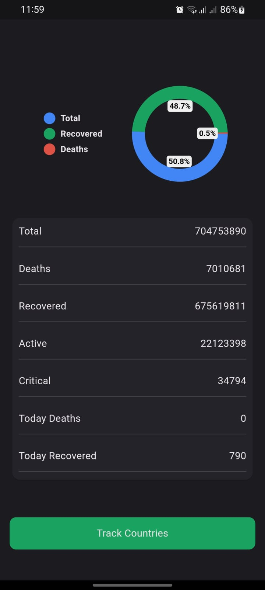
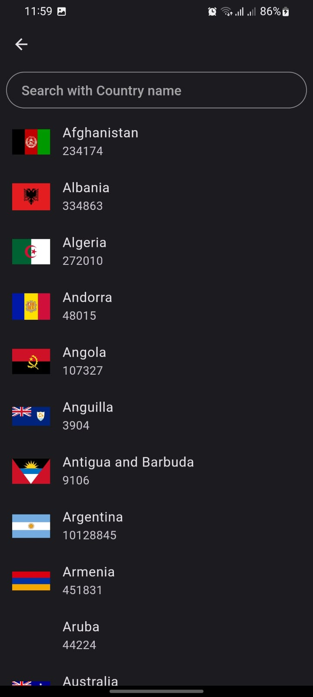
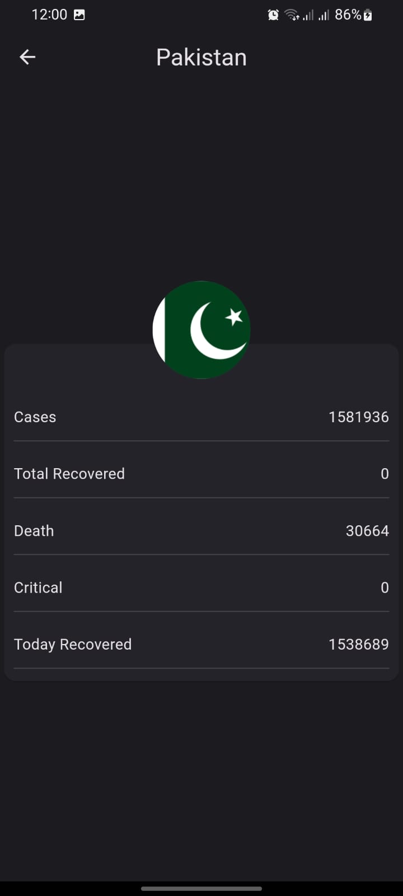

This Flutter-based COVID-19 Tracker App provides real-time data on the COVID-19 pandemic from various countries around the world. Utilizing data fetched through an API, it presents key statistics in an intuitive and visually appealing manner. The app includes a pie chart to display distribution of cases and offers a search functionality to explore data for specific countries.

Features
Real-Time Data: Fetches the latest COVID-19 statistics from an API, ensuring up-to-date information.
Pie Chart Visualization: Graphically represents the distribution of cases (active, recovered, and deaths) using a pie chart.
Search Functionality: Allows users to search for any specific country and view detailed COVID-19 statistics for that country.
Responsive Design: Optimized for both Android and iOS devices.
### Splash Screen

### Dashboard

### Countrylist

### Search Functionality

### Country Details

